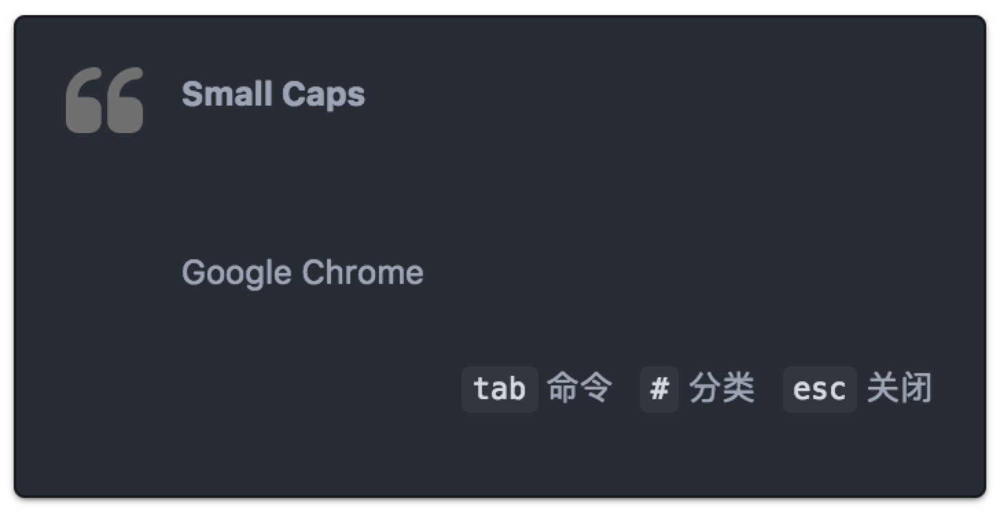
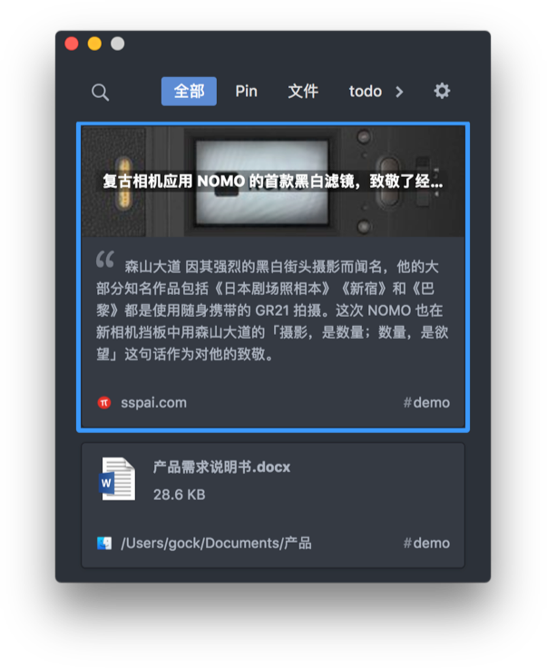

### 通知界面

`空格` 窗口置顶
`shift + 1` Pin（加星收藏）
`#` 添加分类
`tab` 显示可用 workflow 
`a-z` 搜索 workflow
`esc` 关闭窗口
`cmd + delete` 删除内容
`enter` 粘贴

### 列表主界面

`cmd + opt + c` 打开主界面
`tab` 切换tab
`左右箭头` 切换tab
`上下箭头` 选择条目
`shift + 上下箭头` 多选条目
`a-z` 搜索
`esc` 关闭窗口

<h4 style="margin-bottom:0;">选中条目</h4>
`空格` 查看
`enter` 粘贴
`shift + enter` 特殊粘贴
`cmd + delete` 删除
`cmd + e` 编辑文本

